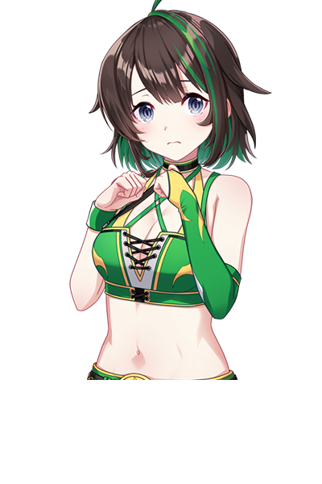
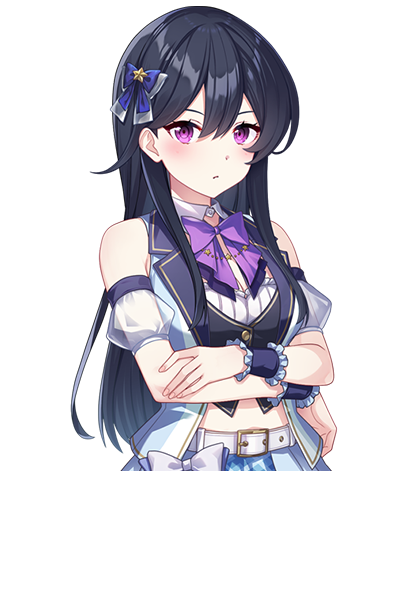
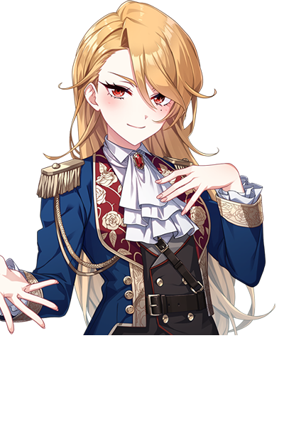
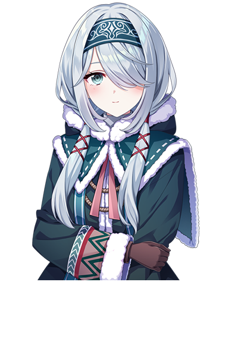
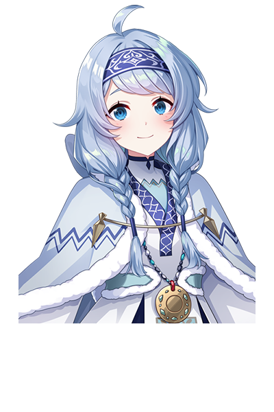
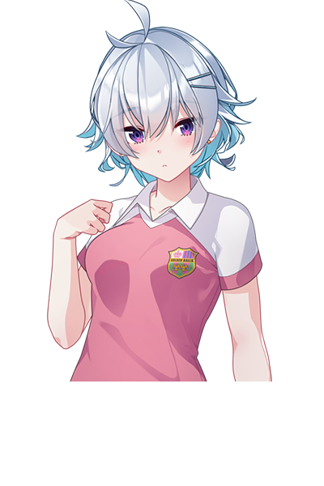

### ✨ My Collection Gallery ✨

<table>
  <tr>
    <td align="center"><br><sub>🌸 #02</sub></td>
    <td align="center"><br><sub>🌸 #03</sub></td>
    <td align="center"><br><sub>🌸 #04</sub></td>
    <td align="center"><br><sub>🌸 #05</sub></td>
    <td align="center"><br><sub>🌸 #06</sub></td>
  </tr>
  <tr>
    <td align="center"><br><sub>🌸 #07</sub></td>
    <td align="center"><br><sub>🌸 #08</sub></td>
    <td align="center"><br><sub>🌸 #09</sub></td>
    <td align="center"><br><sub>🌸 #10</sub></td>
    <td align="center"><br><sub>🌸 #11</sub></td>
  </tr>
  <tr>
    <td align="center"><br><sub>🌸 #12</sub></td>
    <td align="center"><br><sub>🌸 #13</sub></td>
    <td align="center"><br><sub>🌸 #14</sub></td>
    <td align="center"><br><sub>🌸 #15</sub></td>
    <td align="center"><br><sub>🌸 #16</sub></td>
  </tr>
  <tr>
    <td align="center"><br><sub>🌸 #17</sub></td>
    <td align="center"><br><sub>🌸 #18</sub></td>
    <td align="center"><br><sub>🌸 #19</sub></td>
    <td align="center"><br><sub>🌸 #20</sub></td>
    <td align="center"><br><sub>🌸 #21</sub></td>
  </tr>
  <tr>
    <td align="center"><br><sub>🌸 #22</sub></td>
    <td align="center"><br><sub>🌸 #23</sub></td>
    <td align="center"><br><sub>🌸 #24</sub></td>
    <td align="center"><br><sub>🌸 #25</sub></td>
    <td align="center"><br><sub>🌸 #26</sub></td>
  </tr>
  <tr>
    <td align="center"><br><sub>🌸 #27</sub></td>
    <td align="center"><br><sub>🌸 #28</sub></td>
    <td align="center"><br><sub>🌸 #29</sub></td>
    <td align="center"><br><sub>🌸 #30</sub></td>
    <td align="center"><br><sub>🌸 #31</sub></td>
  </tr>
</table>


# WC2026 Card Service

Composites a World Cup prediction card from a background + avatar PNG hosted on GitHub.

## Deploy on Render

1. Push this folder to a GitHub repo (e.g. `wc2026-card-service`)
2. Go to [render.com](https://render.com) → **New** → **Web Service**
3. Connect your GitHub repo
4. Render auto-detects `render.yaml` — just click **Deploy**
5. Your service URL will be: `https://wc2026-cards.onrender.com`

## API

```
GET /card?avatar=5&user=CoolGuy&score=12
```

| Param    | Description                        | Default  |
|----------|------------------------------------|----------|
| `avatar` | Avatar number (2–31)               | 2        |
| `user`   | Discord username (max 20 chars)    | Player   |
| `score`  | Points to display                  | 0        |

Returns a 400×600 PNG card.

---

## YAGPDB Commands

### 1. `!avatar <number>` — user picks their avatar

**Custom Command → Response:**
```
{{if lt (toInt .Args.Get 1) 2}}
  Avatar number must be between 2 and 31!
{{else if gt (toInt .Args.Get 1) 31}}
  Avatar number must be between 2 and 31!
{{else}}
  {{execCC 0 nil 0 (sdict "avatar" (.Args.Get 1) "userID" (toString .User.ID))}}
  ✅ Avatar **{{.Args.Get 1}}** saved, {{.User.Mention}}!
{{end}}
```
**Trigger:** Starts with `!avatar`
**Storage:** Uses YAGPDB user data — save avatar number to key `wc_avatar`

Simpler version (just saves to user data):
```
{{$avatar := toInt (.Args.Get 1)}}
{{if and (ge $avatar 2) (le $avatar 31)}}
  {{dbSet .User.ID "wc_avatar" $avatar}}
  ✅ Avatar **{{$avatar}}** saved, {{.User.Mention}}!
{{else}}
  ❌ Please pick a number between **2** and **31**.
{{end}}
```

---

### 2. `!setcard <@user> <score>` — admin sets score

**Custom Command → Response:**
```
{{if not (.Member.Roles.Has 000000000000)}}
  ❌ You don't have permission to use this command.
{{else}}
  {{$target := (index .Args 1 | userArg)}}
  {{$score := toInt (index .Args 2)}}
  {{dbSet $target.ID "wc_score" $score}}
  ✅ Set score for **{{$target.Username}}** to **{{$score}}** pts.
{{end}}
```
**Trigger:** Starts with `!setcard`
> Replace `000000000000` with your Admin role ID.

---

### 3. `!card` — display your card

**Custom Command → Response:**
```
{{$avatar := dbGet .User.ID "wc_avatar"}}
{{$score  := dbGet .User.ID "wc_score"}}
{{$avatarNum := 2}}
{{$scoreVal  := 0}}
{{if $avatar}}{{$avatarNum = toInt $avatar.Value}}{{end}}
{{if $score}}{{$scoreVal = toInt $score.Value}}{{end}}

{{$url := printf "https://wc2026-cards.onrender.com/card?avatar=%d&user=%s&score=%d" $avatarNum (urlquery .User.Username) $scoreVal}}

{{sendMessage nil (cembed
  "title" (printf "🌍 %s's WC2026 Card" .User.Username)
  "image" (sdict "url" $url)
  "color" 7340032
)}}
```
**Trigger:** Starts with `!card`

---

### 4. `!card @user` — admin views someone else's card

```
{{$target := (.Args.Get 1 | userArg)}}
{{if not $target}}
  {{$target = .User}}
{{end}}
{{$avatar := dbGet $target.ID "wc_avatar"}}
{{$score  := dbGet $target.ID "wc_score"}}
{{$avatarNum := 2}}
{{$scoreVal  := 0}}
{{if $avatar}}{{$avatarNum = toInt $avatar.Value}}{{end}}
{{if $score}}{{$scoreVal = toInt $score.Value}}{{end}}

{{$url := printf "https://wc2026-cards.onrender.com/card?avatar=%d&user=%s&score=%d" $avatarNum (urlquery $target.Username) $scoreVal}}

{{sendMessage nil (cembed
  "title" (printf "🌍 %s's WC2026 Card" $target.Username)
  "image" (sdict "url" $url)
  "color" 7340032
)}}
```
